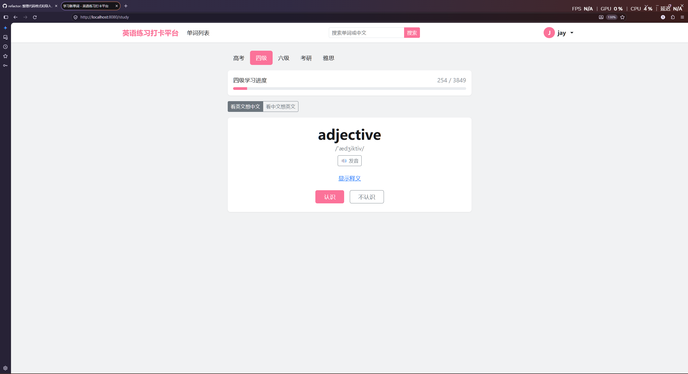
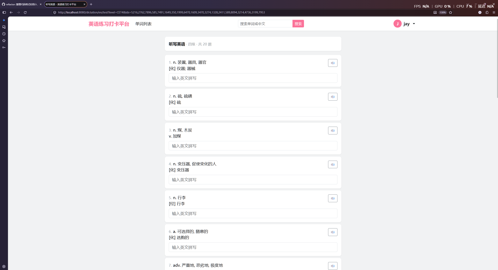
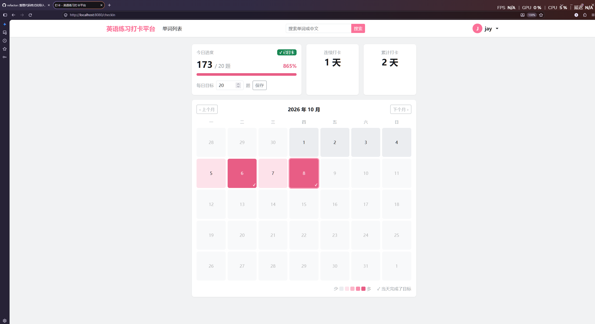

# 英语练习打卡平台

一个基于 **Spring Boot** 的英语单词学习网站：背单词、间隔复习、错题本、听写、每日打卡与学习统计。

词库覆盖 **高考、四级、六级、考研、雅思** 五个级别，共 8674 个单词。

**在线访问：http://122.51.247.76**

> 目前使用 HTTP 访问，暂未启用 HTTPS，注册时请不要使用在其他网站用过的密码。


| 学习 | 听写 | 打卡日历 |
|---|---|---|
|  |  |  |


---

## 功能

| 模块 | 说明 |
|---|---|
| **学习新单词** | 按级别学习，支持「看英文想中文 / 看中文想英文」两种模式，进入新单词时自动朗读 |
| **间隔复习** | 根据记忆情况安排复习时间（1、2、4、7、15、30 天），答错则从头开始 |
| **错题本** | 答错过的单词自动进入，复习时连续答对 3 次后自动移出 |
| **听写** | 听写英语（看释义写拼写）、听写汉语（看单词四选一）；先预习再答题，题目顺序打乱；可用同一组单词重做或只练错题 |
| **每日打卡** | 每天答题达到目标自动打卡（目标可自定义），记录连续天数、最长连续天数，月度热力图日历 |
| **学习统计** | 今日各模式答题数、累计正确率、各级别进度、近 7 / 30 天答题柱状图 |
| **单词列表与搜索** | 按级别浏览，支持英文和中文搜索，以搜索词开头的结果排在前面，匹配文字高亮显示 |
| **账号** | 注册、登录、退出、「记住我」、个人主页 |

---

## 技术栈

| 分类 | 技术 |
|---|---|
| 语言 | Java 21 |
| 框架 | Spring Boot 4、Spring MVC、Spring Security 7 |
| 持久层 | Spring Data JPA（Hibernate 7）、JdbcClient |
| 数据库 | MySQL 26.7 |
| 页面 | Thymeleaf、Bootstrap 5.3、Chart.js 4、原生 JavaScript |
| 测试 | JUnit 6、Spring Boot Test |
| 部署 | Ubuntu 24.04、Nginx、systemd |
| 其他 | Lombok、Maven、Git |

---

## 项目结构

```
src/main/java/com/jay/englishpracticeplatform
├── config/         配置：Spring Security、密码加密
├── controller/     控制器：接收请求、组织页面数据
├── dto/            数据传输对象：页面展示用的数据、表单
├── entity/         JPA 实体
├── exception/      业务异常
├── repository/     数据访问
├── security/       登录相关：用户加载、「记住我」令牌存储
└── service/        业务逻辑

src/main/resources
├── db/migration/   Flyway 数据库迁移脚本（表结构的唯一来源）
├── templates/      Thymeleaf 页面
├── static/         CSS、JavaScript、第三方前端库
└── vocabulary/     词库数据（words.json）

scripts/            词库提取、表结构导出清理脚本（Python）
docs/images/        README 截图
```

---

## 数据库设计

| 表 | 说明 |
|---|---|
| `users` | 用户；密码以 BCrypt 哈希存储 |
| `words` | 单词：拼写（唯一）、音标、释义 |
| `word_levels` | 单词所属的级别（一个单词可以属于多个级别） |
| `user_words` | 每个用户对每个单词的**当前学习状态**：认识 / 不认识次数、连续认识次数、下次复习时间 |
| `answer_records` | **每一次答题**的流水记录：模式、对错、时间；统计和打卡的数据来源 |
| `check_ins` | 打卡记录，每人每天最多一条 |
| `persistent_logins` | 「记住我」令牌（结构由 Spring Security 规定） |

`user_words` 和 `answer_records` 的关系类似银行的**余额**和**交易流水**：前者只保存最新状态，后者保留完整的历史，两者在同一个事务中更新。

---

## 设计要点

### 学习与数据

- **间隔重复**：复习间隔按连续答对次数递增，答错后清零重来；状态只能通过 `markKnown` / `markUnknown` 修改，计算逻辑与当前时间解耦，便于单元测试
- **答题流水表**：每次答题在同一个事务中更新学习状态、写入答题记录、检查打卡，保证三者一致
- **打卡与历史解耦**：打卡结果单独存储，修改每日目标不会改写过去的打卡记录；日历颜色按固定档位计算，不随目标变化
- **听写无状态**：题目由单词 id 生成，服务器不在 Session 中保存试卷；交卷后使用 PRG 模式，刷新结果页不会重复记录

### 数据库结构管理

- **Flyway 版本化迁移**：表结构全部写在 `db/migration` 的 SQL 脚本中，每次变更新增一个版本，启动时自动执行；已执行的脚本由校验和保护，不可修改
- **Hibernate 只做校验**：`ddl-auto=validate`，启动时检查实体与表结构是否一致，不一致则拒绝启动，不再自动修改表
- **已有数据库平滑接入**：通过 baseline 把现有结构登记为版本 1，新环境则从空库完整执行迁移

### 查询

- **聚合查询**：统计数据使用 `GROUP BY` 和条件计数在数据库中完成，不把明细数据搬到内存里计算
- **避免 N+1 查询**：复习和错题本查询使用 `JOIN FETCH` 一次性加载关联的单词
- **搜索排序**：在 SQL 中用 `CASE WHEN` 自定义排序，以搜索词开头的结果优先
- **索引设计**：答题记录按 `(user_id, answered_at)` 建立联合索引，支撑按时间范围的统计查询

### 安全

- **密码**：BCrypt 加盐哈希存储
- **登录**：基于 Spring Security，登录后自动更换 Session ID，防止会话固定攻击；用户不存在和密码错误返回相同提示，防止用户名枚举
- **CSRF**：所有表单自动携带 CSRF 令牌；退出登录使用 POST 请求
- **记住我**：使用持久化令牌方案（系列号 + 令牌），令牌每次使用后更换，可检测令牌被盗用；自行实现 `PersistentTokenRepository`，替代已弃用的官方实现
- **会话**：禁用 URL 会话跟踪，会话 ID 只通过 Cookie 传递，避免出现在网址中
- **输入处理**：所有用户输入在服务端校验；搜索时转义 `LIKE` 通配符；页面输出统一转义，前端高亮使用文本节点构造而非 `innerHTML`，防止 XSS
- **越权**：当前用户身份只从登录状态中获取，不信任请求中提交的用户 id

---

## 本地运行

### 环境要求

- JDK 21
- MySQL（开发使用 26.7 版本）

项目自带 Maven Wrapper，无需单独安装 Maven。

### 步骤

**1. 创建数据库**

```sql
CREATE DATABASE english_practice DEFAULT CHARACTER SET utf8mb4 COLLATE utf8mb4_unicode_ci;
```

**2. 配置数据库账号**

复制 `src/main/resources/application-local.properties.example` 为 `application-local.properties`，填写数据库用户名和密码。该文件已被 `.gitignore` 忽略。

**3. 启动**

```bash
# Windows
mvnw.cmd spring-boot:run

# macOS / Linux
./mvnw spring-boot:run
```

首次启动时，Flyway 会执行 `db/migration` 下的迁移脚本建出所有表，随后从 `vocabulary/words.json` 导入词库。启动完成后访问 http://localhost:8080 。

### 运行测试

```bash
# Windows
mvnw.cmd test

# macOS / Linux
./mvnw test
```

测试会连接本地数据库，并依赖已导入的词库，请先完成一次启动。测试数据在每个测试结束后自动回滚。

---

## 部署

线上环境部署在一台 2 核 4G 的云服务器上（Ubuntu 24.04）：

```
浏览器 ──80──▶ Nginx ──▶ Spring Boot (127.0.0.1:8080) ──▶ MySQL 8.0 (127.0.0.1:3306)
```

| 方面 | 做法 |
|---|---|
| 反向代理 | Nginx 对外监听 80 端口，转发给只监听本机的 Spring Boot；应用通过 `X-Forwarded-*` 请求头获取真实访问信息 |
| 进程管理 | systemd 管理应用进程：开机自启、异常退出自动重启，限制 JVM 堆内存 |
| 配置分离 | `application-prod.properties` 只放与环境相关的非敏感配置；数据库账号密码通过服务器上权限为 600 的环境变量文件注入，不进入代码仓库 |
| 数据库 | 应用使用专用账号，只能从本机登录，只拥有本项目数据库的必要权限；表结构由 Flyway 在空库上自动建立 |
| 网络 | 云防火墙只开放 22、80 端口；MySQL 和应用均只监听 `127.0.0.1` |
| 服务器安全 | 使用普通用户 + sudo 运维，不直接使用 root |
| 备份 | cron 每天凌晨自动导出数据库并压缩，保留最近 7 天 |
| 更新发布 | 部署脚本完成拉取代码、打包、替换、重启和启动检查；保留上一版本以便回滚 |

---

## 后续计划

- [x] 使用 Flyway 管理数据库结构，`ddl-auto` 改为 `validate`
- [x] Controller 层测试（MockMvc）
- [x] 部署上线
- [ ] 配置域名和 HTTPS
- [ ] 使用 GitHub Actions 实现自动测试和部署
- [ ] 修改密码（同时作废该用户所有的「记住我」令牌）
- [ ] 个人词库
- [ ] 答题时不刷新页面

---

## 数据来源与许可

- 词库数据来自 [ECDICT](https://github.com/skywind3000/ECDICT)，MIT License，许可证见 `src/main/resources/vocabulary/LICENSE-ECDICT.txt`
- [Bootstrap](https://getbootstrap.com/)，MIT License
- [Chart.js](https://www.chartjs.org/)，MIT License